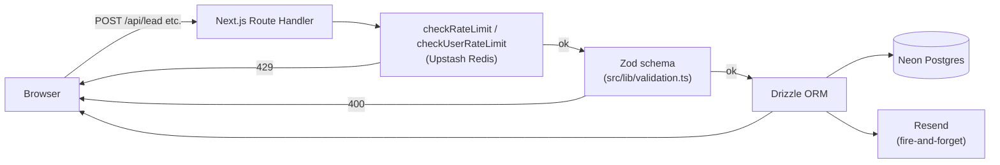
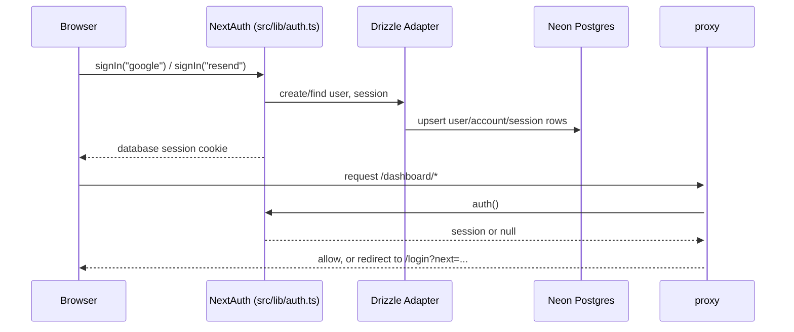

# Architecture

Marram is a Next.js 16 (App Router) app with three audiences under one codebase:
a public marketing/directory site, an authenticated couple's planning dashboard,
and public read-only wedding sites published by couples at `/w/[slug]`.

## Stack

| Layer | Choice |
|---|---|
| Framework | Next.js 16 (App Router), React 19, TypeScript |
| Styling | Tailwind CSS v4 (`@theme` tokens in `src/app/globals.css`) |
| Database | Neon (serverless Postgres) via `@neondatabase/serverless` |
| ORM | Drizzle (`src/lib/db/schema.ts`, pushed with `drizzle-kit`) |
| Auth | NextAuth v5 (`next-auth@beta`) — Google OAuth + Resend magic-link, database sessions via `@auth/drizzle-adapter` |
| Rate limiting | Upstash Redis + `@upstash/ratelimit`, sliding window |
| Email | Resend (transactional: lead/inquiry/RSVP notifications, magic-link) |
| Client state | Zustand (`persist` middleware) |
| Forms/validation | `react-hook-form` + Zod |

## Route map

```
src/app/
├─ (site)/            public marketing + directory: /, /weddings, /inspiration,
│                      /venues, /vendors, /services, /planning/*, /about, /faq,
│                      /contact, /guide, /privacy, /terms
├─ (app)/dashboard/    auth-gated planning tools: budget, guests, inspiration,
│                      rsvps, settings, site, tasks, timeline, vendors, venues
├─ w/[slug]/           published couple sites (public, read-only)
├─ login/, login/verify/
└─ api/                lead, inquiry, rsvp, publish-site, user-state,
                       auth/[...nextauth]
```

The `(site)` and `(app)` segments are route groups — they don't appear in the
URL, they exist to give the dashboard its own layout and auth gate.

**Dashboard auth gate** — `src/proxy.ts` runs `auth()` against every request
(matcher excludes static assets/images) and redirects unauthenticated
`/dashboard/*` requests to `/login?next=<path>`. `src/app/login/actions.ts`
validates that `next` is a same-site relative path before handing it to
`signIn()`, so it can't be turned into an open redirect.

**Indexing** — `src/app/robots.ts` disallows `/dashboard/*`, `/w/*`, and
`/api/*`. Nothing about a couple's private planning or a published site is
meant to reach a search index by design (published sites are meant to be
shared by direct link, not discovered).

## Request flow



## Auth flow



Session strategy is `database` (not JWT) — every session lookup hits
`sessions` in Postgres via the adapter, so revoking a session is a row
delete, not a token-expiry wait.

## Client state and the server sync

Three Zustand stores — `planning` (tasks/budget/guests/wedding details),
`saves` (bookmarked inspiration/venues/vendors), `site` (the couple's site
builder draft) — all read/write through one swappable `StateStorage`
(`src/lib/data/storage.ts`), keyed under a `marram:` prefix.

- **Signed out**: `browserStorage` — plain `localStorage`.
- **Signed in**: `serverStorage` — `GET/PUT/DELETE /api/user-state`, one row
  per `(userId, key)` in the `user_state` table.
- The switch is decided per-call from a **3-second-cached** `getSession()`
  read (`getCachedSession`, `storage.ts:85-93`) so autosave-on-every-keystroke
  doesn't hit `/api/auth/session` on every write.
- **First sign-in migration**: before the *first* server-backed read,
  `migrateLocalDataIfNeeded()` (`src/lib/auth/migrate-local-data.ts`) pushes
  any pre-account `localStorage` data up to the server, cached in-flight so
  the three stores mounting at once share one migration instead of racing
  three (`storage.ts:71-77`, audit P0-2).
- **Failure semantics**: a failed `getItem`/`setItem`/`removeItem` **throws**
  rather than resolving `null`/success — a transient 500 must not be read by
  zustand's `persist` as "no data yet," which would hydrate the store to
  defaults and let the next autosave overwrite the couple's real row (audit
  P0-1). See `docs/DATABASE.md` and `docs/SECURITY.md` for the server side of
  this contract.

Only `planning`, `wedding-site`, and `saves` are still written through this
layer (`MANAGED_KEYS`, `storage.ts:125`) — `leads`/`inquiries` moved to
hitting `/api/lead` and `/api/inquiry` directly and are no longer persisted
here.

## Directory map

| Path | Contents |
|---|---|
| `src/app` | Routes (see route map above) |
| `src/components` | UI grouped by domain: `analytics`, `auth`, `cards`, `chrome`, `dashboard`, `directory`, `editorial`, `forms`, `gallery`, `home`, `seo`, `site-builder`, `tools`, `ui` |
| `src/lib` | `auth.ts`, `auth/migrate-local-data.ts`, `db/{client,schema}.ts`, `email/`, `rate-limit.ts`, `ownership.ts`, `validation.ts`, `store/` (Zustand stores), `data/` (storage adapter), `utils.ts`, `analytics.ts`, `budget.ts`, `quiz.ts`, `seo.ts`, `fonts.ts` |
| `src/content` | Static domain content (weddings, inspiration, venues, vendors, services, styles, faq, media, brand) — see `docs/DESIGN.md` |
| `src/types` | Domain model shared by content and UI |
